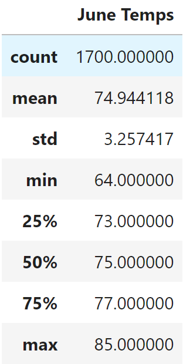
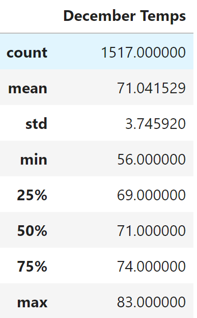

# Surfs-Up Business Analysis
## Overview of the analysis
Surfs-Up Business Analysis project uses Python, SQLAlchemy, and Flask to analyze climate data. And base on the weather analysis, we explore the temperature trends in order to determine if there is surf_shop business is sustainable year aroud. We focus on the statistical analysis for June and December, which provide a business report to help investors to do decision making.

## Results
We extract data from the weather dataset, filter and sort the dataset to create two DataFrame for June and December temperatures. The following tables shows the results:

### June Temperature    Vs.     December Temperature

         

- The Average Temperature on June vs. December has only about 3degrees different.
- Comparing the 75 percentile and the highest temperature between June and December has not much significant different.  
- The lowest temperature between June and December only has 8degrees different.

## Summary
According to our temperature analysis results, we can conclude that the temperature in summer and winter time for the Hawaii around the same. It doesn't have significant difference between June and December. In order to satisfy investors' interest, we could narrow our dataset. Adding the following queries that we perform to take a closer look for recent weather data for June and December,see(1,2). In addition, we can query the temperature of the most active station to analysis June and December,see(3,4).

### Additional Resources
1. session.query(Measurement.date,Measurement.tobs).filter(extract('year', Measurement.date) >= 2016).filter(extract('month', Measurement.date) == 6)
2. session.query(Measurement.date,Measurement.tobs).filter(extract('year', Measurement.date) >= 2016).filter(extract('month', Measurement.date) == 12)
3. session.query(Measurement.date,Measurement.tobs).filter(Measurement.station == 'USC00519281').filter(extract('month', Meaurement.date) == 6)
  - view result: https://github.com/FIRE-Phoebe/surfs_up/blob/9ddea5bd4abc8a89161d3f5e497c3788186ca825/Resources/station_june_result.PNG
4. session.query(Measurement.date,Measurement.tobs).filter(Measurement.station == 'USC00519281').filter(extract('month', Measurement.date) == 12)
  - view result: https://github.com/FIRE-Phoebe/surfs_up/blob/9ddea5bd4abc8a89161d3f5e497c3788186ca825/Resources/station_dec_result.PNG
